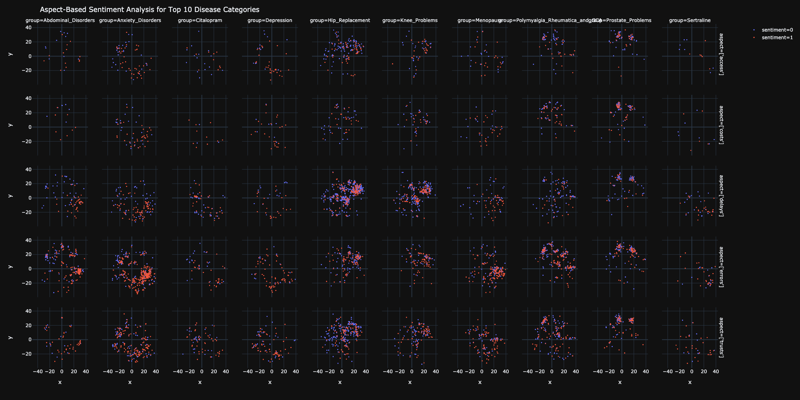

# Aspect-Based Sentiment Analysis for Patients' Narratives

by **Vanilla Deep** (*Jianheng Hou*, *Zheng Cao*, *Jiasheng Wu*, *Yuang Liang*)

*Aspect-Based Sentiment Analysis for Top 10 Disease Categories*

## Introduction

### Problem Statement

### Challenges

**Labels Colleteced by Annotators** Description.

**Highly Imbalanced Dataset** Description.

**Multi-Label Classification** Description.

**Visualization and Insights Acquisition** Description.

## Pipeline

## Data Preparation

## Model Training

### Pooled RNN

### Pooled RNN with TextCNN

### BERT

### Assembled Model

## Visualization

## Summary

## References
