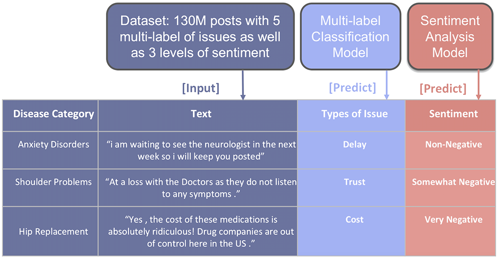
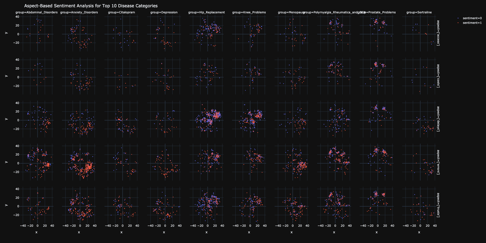
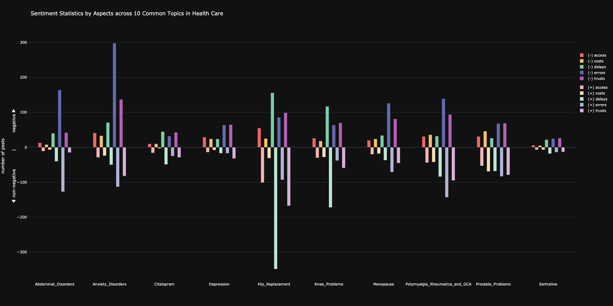

# Aspect-Based Sentiment Analysis for Patients' Narratives

by **Vanilla Deep** (*Jianheng Hou*, *Zheng Cao*, *Jiasheng Wu*, *Yuang Liang*)

## Introduction

### Background

As known to all, data science and analysis has brought innovation to the financial investment industry in recent years.  The idea of this project came from venture capital field: partners in firm want to leverage data science to extract insights hiding in the data on healthcare field. This is an innovative pipeline to dig out and monitor patient’s suffering, or say, issues in healthcare so to support investment strategy of VC firms.  This is a typical end-to-end Text Mining Project. Aspect-based sentiment analysis, as the main part of the project,  is used to analyze the sentiment of patient’s narrative with different aspects we defined.

### Problem Statement

Different from traditional sentiment analysis, we analyze sentiment by different issue categories which are predicted by another model. 

  
  <em>Problem Formulation</em>

Given each post of patient’s narrative, multi-label classification predicts what types of issues this post mentions. We defined 5 types of issues in healthcare I are interested. Then sentiment classification model predicts the sentiment of the post. We defined 2 different levels of sentiment, i.e. 1. Non-negative; 2. Negative. By this way, it is easier to know the sentiment distribution of tons of posts from different aspects that we defined.

### Challenges

The first challenge comes from the annotation. We collect data without labels from the biggest patient online forum (Patient.info.) in U.K and the U.S. We trained data with ground truth labeled by annotators in the market, so the performance of our model was limited to the quality of this data we collected. The second challenge is high imbalance of the dataset we created, in which the data from the majority class occupies 87% of all. The third challenge is that multi-label classification made our models hard to train, because insufficient minority data might not be learnt by models and the choosing of metrics for loss function and evaluation is a trick during training stage. To generate readable and intuitive visualization based on the output of models and to extract actionable insights from it is the last challenging point.

## Pipeline

## Data Preparation

## Model Training

### Pooled RNN

### Pooled RNN with TextCNN

### BERT

### Assembled Model

## Visualization

  
  <em>Aspect-Based Sentiment Analysis for Top 10 Disease Categories</em>

  
  <em>Sentiment Statistics by Aspects across 10 Common Topics in Health Care</em>

## Summary

## References
