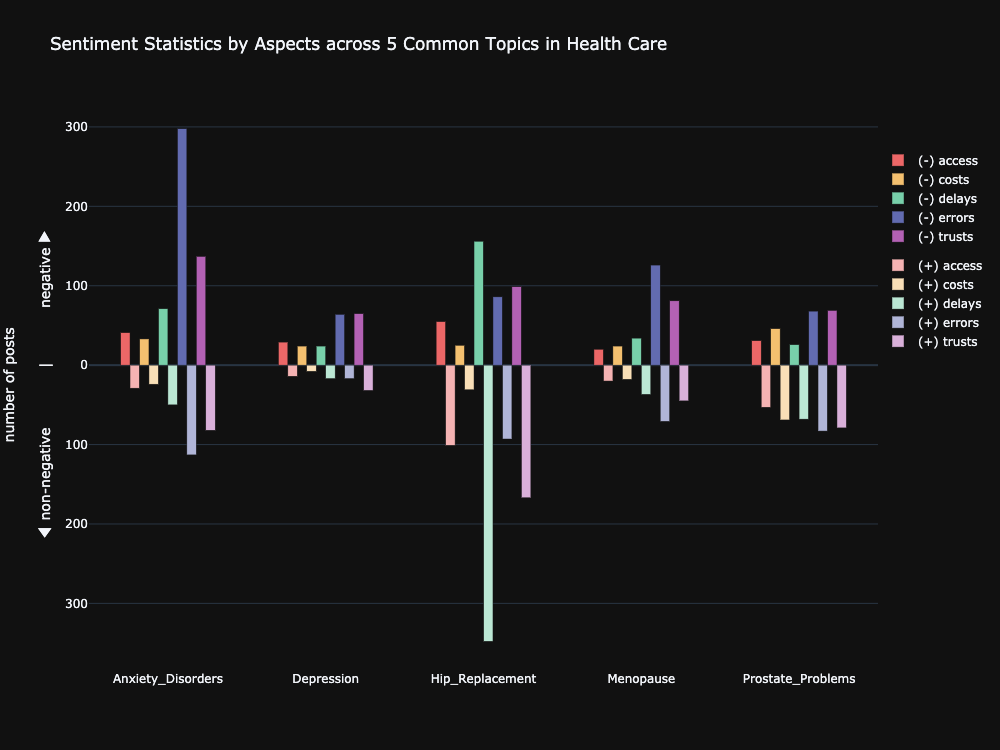

# Aspect-Based Sentiment Analysis for Patients' Narratives

by **Vanilla Deep** (*Jianheng Hou*, *Zheng Cao*, *Jiasheng Wu*, *Yuang Liang*)

## Introduction

### Problem Statement

### Challenges

**Labels Colleteced by Annotators** Description.

**Highly Imbalanced Dataset** Description.

**Multi-Label Classification** Description.

**Visualization and Insights Acquisition** Description.

## Pipeline

## Data Preparation

## Model Training

### Pooled RNN

### Pooled RNN with TextCNN

### BERT

### Assembled Model

## Visualization

  
  <em>Aspect-Based Sentiment Analysis for Top 10 Disease Categories</em>

  
  <em>Sentiment Statistics by Aspects across 5 Common Topics in Health Care</em>

## Summary

## References
